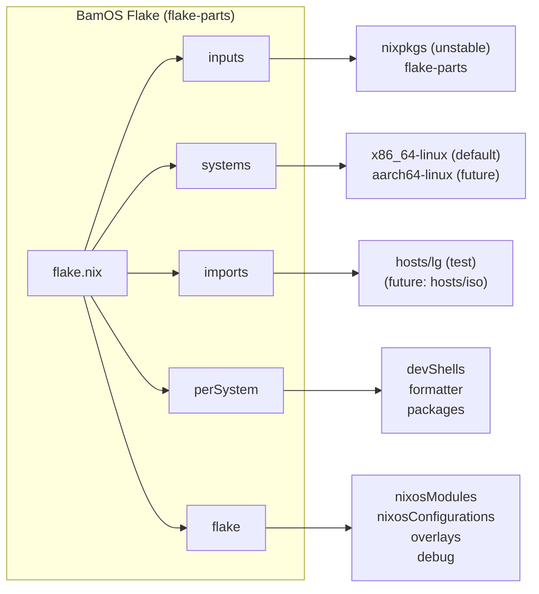
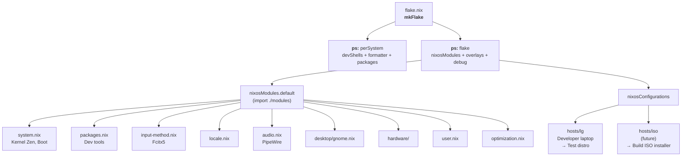
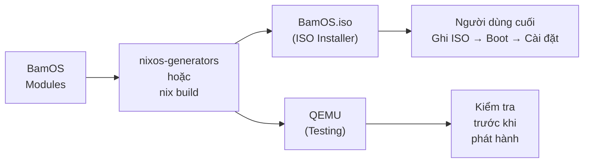

# BamOS — Bảng Thiết Kế Kiến Trúc Hệ Thống (Architecture Design Document)

## 1. Tầm nhìn & Triết lý thiết kế (Vision & Philosophy)

**BamOS** là một bản phân phối Linux (Linux distribution) được xây dựng trên nền tảng **NixOS**, thiết kế dành riêng cho người dùng Việt Nam. Mục tiêu không chỉ là một bộ cấu hình cá nhân — BamOS là một **distro hoàn chỉnh**, có thể được cài đặt từ ISO, sử dụng hàng ngày, và phân phối đến cộng đồng.

Triết lý cốt lõi **"Tích hợp sẵn" (Out-of-the-box)** — mọi thứ hoạt động ngay sau khi cài đặt, không cần cấu hình thêm:

1. **Out-of-the-box (Sẵn sàng tức thì):** Hệ thống đến tay người dùng cuối với tiếng Việt, bộ gõ, driver phần cứng, và ứng dụng phổ thông đã được cài đặt và cấu hình sẵn. Không cần mở terminal, không cần "tùy biến" sau cài đặt.

2. **Immutable Core (Lõi bất biến):** Hệ thống gốc (root) không thể bị phá hỏng bởi người dùng cuối. Mọi thay đổi đều thông qua declarative config hoặc container (Flatpak, Distrobox). Có thể rollback về trạng thái hoạt động tốt nhất chỉ bằng một lần reboot chọn generation cũ.

3. **Familiarity (Thân thiện thói quen):** Mô phỏng trải nghiệm quen thuộc "Ổ C — Ổ D" với cơ chế Btrfs subvolume, kết hợp App Store trực quan thay vì dòng lệnh.

4. **Reproducible (Tái tạo tuyệt đối):** Mọi bản cài đặt BamOS từ cùng một commit đều giống hệt nhau. Không có "máy tôi chạy được" — chạy được trên tất cả.

### Phạm vi dự án

```
BamOS Distribution
├── ISO Installer            # File .iso để cài đặt lên máy mới
│   └── Dành cho: Người dùng cuối
│
├── Host Configs (hosts/)    # Cấu hình cho từng máy cụ thể
│   └── hosts/lg             # Developer laptop — dùng để test distro
│
├── NixOS Modules (modules/) # Module dùng chung cho mọi máy
│
└── BamOS Modules (modules/) # Module BamOS (kênh phần mềm riêng, v.v.)
```

---

## 2. Kiến trúc 4 Trụ cột (The 4 Pillars of Architecture)

### Trụ cột 1: Lõi Hạt nhân (Kernel Strategy)

Hệ thống sử dụng duy nhất **Linux Zen Kernel** (`linuxPackages_zen`) — một kernel được tối ưu cho desktop và gaming — thay thế kernel mặc định của NixOS. Zen kernel mang lại:

- **Độ mượt mà cao** cho tác vụ hàng ngày nhờ bộ lập lịch (scheduler) tinh chỉnh.
- **Low latency** cho âm thanh và giao diện đồ họa.
- **Tương thích** với cả Intel và AMD, phù hợp với máy tính lắp ráp và laptop phổ thông — đối tượng chính của BamOS.

```nix
boot.kernelPackages = pkgs.linuxPackages_zen;
```

### Trụ cột 2: Quản trị Lưu trữ (Btrfs Subvolumes & Storage)

Kiến trúc giải quyết triệt để nỗi lo mất dữ liệu khi cài lại hệ điều hành, bằng cách tách biệt vùng hệ thống và vùng dữ liệu người dùng trên cùng một bể dung lượng vật lý (Btrfs storage pool). Đây là cấu hình phân vùng mặc định trên ISO:

| Subvolume | Mục đích | Ghi chú |
|-----------|----------|---------|
| **`/`** | Hệ thống gốc (cấu hình OS + ứng dụng lõi) | Được ghi đè khi cài lại / rollback |
| **`/home`** | Dữ liệu người dùng | **An toàn tuyệt đối** khi cài lại |
| **`/nix`** | Nix store (packages) | Được tái sử dụng, tiết kiệm băng thông |
| **`/boot`** | EFI partition (vfat) | Độc lập, không đụng đến |

**Cơ chế Rollback:** Mọi thao tác phục hồi (NixOS Generations) hoặc cài đặt lại chỉ ghi đè lên `/`, đảm bảo `/home` và `/nix` tồn tại vĩnh viễn và an toàn.

### Trụ cột 3: Hệ sinh thái Ứng dụng & Vùng chứa (App Layer & Containers)

BamOS nói không với việc cài đặt các gói phần mềm truyền thống (`.deb`, `.rpm`) trực tiếp lên hệ thống lõi để tránh "Dependency Hell".

```
User Desktop
├── BamOS Base (declarative, reprodu)
│   ├── GNOME Desktop
│   ├── Fcitx5 + Bamboo
│   ├── PipeWire
│   └── Dev tools
│
├── Flatpak (App phổ thông)
│   ├── Trình duyệt (Firefox)
│   ├── Zalo, Messenger
│   ├── Spotify
│   └── ... (sandboxed, tự do cài thêm)
│
└── Distrobox (Dev & App đặc thù)
    ├── Ubuntu container (cho dev tool)
    ├── Ubuntu → `distrobox-export` ra UI
    └── Arch container (cho AUR packages)
```

- **Nix Declarative Packages:** Gói lõi được khai báo trong Nix config. Không cài thủ công.
- **Flatpak:** Giao diện GNOME Software làm App Store. Người dùng cuối click để cài.
- **Distrobox:** Vùng chứa (containers) Ubuntu/Arch chạy nền. App được export ra menu ứng dụng nhờ `distrobox-export`.

### Trụ cột 4: Trải nghiệm Bản địa & Khôi phục (OOTB UX & Desktop Recovery)

Gói gọn trong 4 chữ: **"Cài xong dùng được ngay" (Plug & Play).**

- **Input Method:**
  - Fcitx5 + Bamboo engine — hỗ trợ Telex, VNI, và các kiểu gõ tiếng Việt phổ biến.
  - Hoạt động native trên GTK, Qt, Electron, và cả Flatpak.
  - Biến môi trường `XMODIFIERS`, `GTK_IM_MODULE`, `QT_IM_MODULE` được set sẵn.

- **PipeWire Audio:**
  - Modern audio framework, thay thế hoàn toàn PulseAudio.
  - Hỗ trợ ALSA + 32-bit (game, ứng dụng cũ).
  - Bluetooth audio (A2DP, HSP) sẵn sàng.

- **GNOME Desktop:**
  - GDM display manager — màn hình đăng nhập đẹp, hỗ trợ Wayland.
  - Tinh chỉnh bỏ bloatware (`evolution-data-server` force disabled).
  - Tắt các service không cần: printing, avahi, power-profiles-daemon.

- **Factory Reset UI:**
  - (Lộ trình) Module trong BamOS Portal cho phép người dùng khôi phục cấu hình giao diện (`~/.config`) về trạng thái nguyên bản bằng một nút bấm.
  - Giải quyết vấn đề "vọc vạch làm hỏng UI" mà không cần cài lại máy.

---

## 3. Kiến trúc Flake-parts (Framework Architecture)

### 3.1. Tại sao flake-parts?

[**flake-parts**](https://flake.parts/) (bởi [hercules-ci](https://github.com/hercules-ci/flake-parts)) là một framework modular cho Nix flakes, mang module system của NixOS lên cấp độ flake:



| Tính năng | Lợi ích |
|-----------|----------|
| **`perSystem`** | Tự động quản lý per-system attributes (packages, devShells, ...) — giảm boilerplate code |
| **Module imports** | Chia `flake.nix` thành nhiều file module riêng biệt — tổ chức code gọn gàng |
| **`debug = true`** | Cho phép inspect toàn bộ config qua `nix repl` — gỡ lỗi dễ dàng |
| **`nixosModules`** | Export NixOS modules có thể tái sử dụng bởi flake khác — cộng đồng có thể dùng modules của BamOS |
| **`transposition`** | Đảo ngược cấu trúc dữ liệu giữa `perSystem` và flake outputs — linh hoạt khi mở rộng |

### 3.2. Sơ đồ luồng hoạt động



### 3.3. ISO Building Pipeline (Lộ trình)

Một trong những mục tiêu chính của BamOS là tạo ra file ISO để phân phối. Pipeline ISO sẽ hoạt động như sau:



Kỹ thuật:
- Sử dụng [`nixos-generators`](https://github.com/nix-community/nixos-generators) (`nixpkgs.nixos-generate`) hoặc `nix build .#nixosConfigurations.iso.config.system.build.isoImage`
- ISO sẽ dùng **disko** để tự động phân vùng Btrfs (subvolumes `/`, `/home`, `/nix`)
- Hỗ trợ cả UEFI (systemd-boot) và Legacy BIOS (GRUB) — tương thích tối đa phần cứng

---

## 4. Cấu trúc thư mục (Directory Structure)

Dự án kế thừa cấu trúc từ [Misterio77/nix-starter-configs](https://github.com/Misterio77/nix-starter-configs) (phiên bản *standard*) và mở rộng theo hướng distro với ISO support:

```
bamos/
├── flake.nix                           # Entry point — flake-parts mkFlake
├── flake.lock                          # Khóa phiên bản dependencies
├── README.md                           # Tổng quan dự án
├── ARCHITECH.md                        # Tài liệu kiến trúc (file này)
│
├── hosts/                              # [Mở rộng] Định nghĩa máy
│   └── lg/                             # TEST: Laptop developer
│       └── default.nix                 #   → nixosConfigurations.lg
│   # (future) iso/
│   #     └── default.nix               # → nixosConfigurations.iso → ISO build
│
├── nixos/                              # [Theo starter] NixOS config chính
│   ├── configuration.nix               #   Cấu hình chính (thin)
│   └── hardware-configuration.nix      #   Auto-generated hardware scan
│
├── modules/                            # [Theo starter] NixOS modules
│   ├── default.nix                     #   Aggregator (imports tất cả)
│   ├── system.nix                      #   Boot, kernel Zen, flakes
│   ├── packages.nix                    #   System packages
│   ├── input-method.nix                #   Fcitx5 + Bamboo
│   ├── locale.nix                      #   VN locale, time zone
│   ├── audio.nix                       #   PipeWire
│   ├── user.nix                        #   User accounts
│   ├── optimization.nix                #   Tắt dịch vụ không dùng
│   ├── hardware/
│   │   ├── bluetooth.nix               #   Bluetooth config
│   │   └── network.nix                 #   NetworkManager
│   └── desktop/
│       └── gnome.nix                   #   GNOME + GDM
│
├── pkgs/                               # [Theo starter] Custom packages
│   └── default.nix                     #   (placeholder, sẵn sàng mở rộng)
│
├── overlays/                           # [Theo starter] Nix overlays
│   └── default.nix                     #   (placeholder, sẵn sàng mở rộng)
│
└── .zed/
    └── settings.json                   # Cấu hình Zed editor
```

> **Lưu ý:** `hosts/lg` là cấu hình **test** dành riêng cho máy laptop developer. Distro thực tế sẽ được build từ `hosts/iso/` (hoặc tương đương) để tạo file `.iso` cài đặt cho người dùng cuối.

### 4.1. Tham chiếu cấu trúc starter gốc

| Thành phần | Misterio77/standard | BamOS |
|-----------|---------------------|-------|
| **Flake entry** | `flake.nix` + `flake.lock` | `flake.nix` + `flake.lock` |
| **Framework** | Raw flake + `forAllSystems` | **`flake-parts`** với `mkFlake` |
| **NixOS configs** | `nixos/` directory | `nixos/` + **`hosts/`** cho multi-machine |
| **Modules** | `modules/nixos/` | `modules/` (flat + subdirectories) |
| **Custom pkgs** | `pkgs/default.nix` | `pkgs/` (sẵn sàng) |
| **Overlays** | `overlays/default.nix` | `overlays/` (sẵn sàng) |
| **Mục tiêu** | Personal dotfiles | **Distro ISO + community distribution** |

### 4.2. Giải thích module tree

```
modules/
├── default.nix           # Aggregator: imports tất cả module bên dưới
├── system.nix            # Boot, kernel Zen, hostname, experimental-features
├── packages.nix          # curl, git, fzf, ripgrep, vim, zed-editor, bluez, nil
├── input-method.nix      # Fcitx5 + Bamboo + session variables (XMODIFIERS, ...)
├── locale.nix            # Asia/Ho_Chi_Minh, vi_VN locale, en_US default
├── audio.nix             # PipeWire (ALSA, PulseAudio compat, 32-bit)
├── user.nix              # User quocnho (networkmanager + wheel)
├── optimization.nix      # Tắt printing, avahi, power-profiles-daemon
├── hardware/
│   ├── bluetooth.nix     # Bluetooth + powerOnBoot
│   └── network.nix       # NetworkManager
└── desktop/
    └── gnome.nix         # GDM, GNOME, mkForce tắt evolution-data-server
```

---

## 5. Cây quyết định Flake (Flake Decision Tree)

```mermaid
flowchart LR
    A["`BamOS Flake`"] --> B["`**inputs:**
    - nixpkgs (unstable)
    - flake-parts`"]

    A --> C["`**ps:** flake-parts.mkFlake`"]
    C --> D["`psk: systems = ["x86_64-linux"]`"]
    C --> E["`psk: imports = [./hosts/lg]`"]
    C --> F["`psk: perSystem = { pkgs, ... }: { ... }`"]
    C --> G["`psk: flake = { ... }`"]

    F --> H["`psk: devShells.default
    nil + nixd + nix-output-monitor
    + nixpkgs-fmt + deadnix + statix`"]
    F --> H2["`psk: formatter = pkgs.nixpkgs-fmt
    (chạy với nix fmt)`"]
    F --> H3["`psk: packages = import ./pkgs pkgs
    (custom packages)`"]

    G --> I["`psk: nixosModules.default
    = import ./modules`"]
    G --> J["`psk: overlays = import ./overlays { ... }
    (overlay cho nixpkgs)`"]
    G --> K["`psk: debug = true
    (inspect với nix repl)`"]

    E --> L["`psk: flake.nixosConfigurations.lg
    = nixpkgs.lib.nixosSystem {
        specialArgs = { inherit inputs; };
        modules = [
            self.nixosModules.default
            ./nixos/configuration.nix
        ];
    }`"]
```

---

## 6. Cách mở rộng (Extending BamOS)

### Thêm máy test mới

```bash
# 1. Tạo thư mục cho máy mới
mkdir -p hosts/<tên-máy>

# 2. Tạo file cấu hình
cat > hosts/<tên-máy>/default.nix << 'EOF'
{ self, inputs, ... }: {
  flake.nixosConfigurations.<tên-máy> = inputs.nixpkgs.lib.nixosSystem {
    system = "x86_64-linux";
    specialArgs = { inherit inputs; };
    modules = [
      self.nixosModules.default
      ./../../nixos/configuration.nix
    ];
  };
}
EOF

# 3. Thêm vào imports trong flake.nix
# imports = [ ./hosts/lg ./hosts/<tên-máy> ];

# 4. Sinh hardware-config
# sudo nixos-generate-config --root /mnt
# cp /mnt/etc/nixos/hardware-configuration.nix ./nixos/hardware-<tên-máy>.nix
```

### Build ISO (Kế hoạch)

Khi pipeline ISO hoàn thiện:

```bash
# Cách 1: Dùng nixos-generators
nix run nixpkgs#nixos-generate -- --flake .#iso --format iso

# Cách 2: Build trực tiếp từ flake
nix build .#nixosConfigurations.iso.config.system.build.isoImage
```

### Thêm custom package

```nix
# pkgs/my-package/default.nix
{ lib, buildNpmPackage, fetchFromGitHub }:

buildNpmPackage rec {
  pname = "my-package";
  version = "1.0.0";
  src = fetchFromGitHub { ... };
  # ...
}
```

### Thêm NixOS module

```nix
# modules/my-module.nix
{ config, lib, pkgs, ... }: {
  options.services.my-service = {
    enable = lib.mkEnableOption "My Service";
  };
  config = lib.mkIf config.services.my-service.enable {
    # implementation
  };
}
```

Sau đó thêm vào `modules/default.nix`.

---

## 7. Công cụ phát triển (Development Tooling)

Khi vào `nix develop`, BamOS cung cấp:

| Tool | Công dụng |
|------|-----------|
| **nil** | Nix language server (LSP) — autocomplete, diagnostics, go-to-definition |
| **nixd** | Nix language server (alternative) — diagnostics, completions |
| **nixpkgs-fmt** | Formatter cho file `.nix` — `nix fmt` |
| **nix-output-monitor** | Theo dõi tiến trình build Nix với giao diện đẹp |
| **deadnix** | Phát hiện code Nix chết (dead code) — giữ codebase sạch |
| **statix** | Linter cho Nix code — phát hiện anti-patterns |

Zed editor được cấu hình sẵn qua `.zed/settings.json` để dùng `nil` + `nixpkgs-fmt`.

---

## 8. Lộ trình phát triển (Roadmap)

### Phase 1 — Core Foundation ✅ (Hoàn thành)
- [x] flake-parts foundation với `mkFlake`
- [x] Zen kernel (`linuxPackages_zen`)
- [x] GNOME desktop (GDM + Wayland)
- [x] systemd-boot, EFI support
- [x] Dev environment (`nix develop`)

### Phase 2 — Bản địa hóa ✅ (Hoàn thành)
- [x] Fcitx5 + Bamboo (gõ tiếng Việt)
- [x] VN locale (`Asia/Ho_Chi_Minh`, `vi_VN`)
- [x] PipeWire audio (ALSA + 32-bit)
- [x] Tối ưu dịch vụ (tắt bloat)
- [x] Reusable modules structure

### Phase 3 — Distro ISO 🔄 (Đang thực hiện)
- [ ] hosts/iso configuration
- [ ] nixos-generators / isoImage build pipeline
- [ ] Disko partitioning (Btrfs subvolumes)
- [ ] Calamares hoặc custom installer (Yad + Bash)
- [ ] QEMU testing script
- [ ] CI/CD tự động build ISO

### Phase 4 — App Layer (Kế tiếp)
- [ ] Flatpak integration + Flathub
- [ ] GNOME Software làm App Store
- [ ] Distrobox containers cho dev & đặc thù

### Phase 5 — BamOS Portal (Tương lai)
- [ ] Factory Reset Desktop (1-click restore UI)
- [ ] Driver manager (NVIDIA, AMD, Intel)
- [ ] System info dashboard

### Phase 6 — Community (Tương lai)
- [ ] Home Manager integration
- [ ] Custom packages (`pkgs/`) + Overlays (`overlays/`)
- [ ] Documentation website
- [ ] Community modules registry

---

## 9. Tham khảo (References)

- [NixOS Manual](https://nixos.org/manual/nixos/stable/)
- [flake-parts Documentation](https://flake.parts/)
- [hercules-ci/flake-parts](https://github.com/hercules-ci/flake-parts)
- [Misterio77/nix-starter-configs](https://github.com/Misterio77/nix-starter-configs)
- [nixos-generators](https://github.com/nix-community/nixos-generators)
- [NixOS Wiki - Flakes](https://wiki.nixos.org/wiki/Flakes)
- [NixOS Wiki - ISO generation](https://wiki.nixos.org/wiki/Cheatsheet#Build_and_boot_an_ISO_from_your_configuration)
