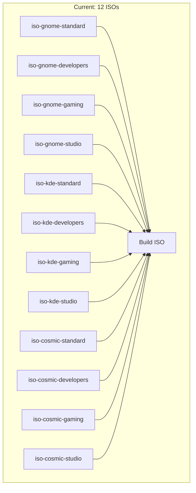
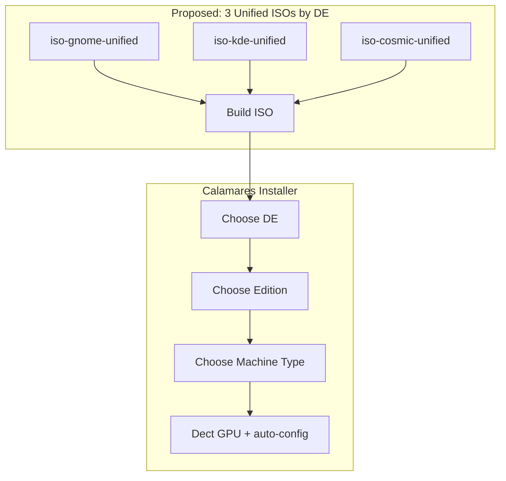

# Technology Assessment: GLF-OS ISO Strategy & GPU Detection

**Date:** 2026-07-09
**Researched by:** AI Agent (tech skill)
**Status:** Complete

## Executive Summary

GLF-OS uses a **single unified ISO** approach instead of building multiple variants. All hardware detection (GPU, keyboard layout) happens at install time via Calamares, not at build time. This reduces build complexity from N variants to 1, while still supporting NVIDIA/AMD/Intel GPUs through runtime detection. BamOS should adopt this pattern as planned in Phase 9.

---

## Requirements Context

| Requirement | Description |
|-------------|-------------|
| **Build Complexity** | Currently 12 ISOs → reduce to 1-3 unified ISOs |
| **GPU Support** | NVIDIA (multiple generations), AMD, Intel |
| **User Choice** | Edition + DE selection at install time |
| **Keyboard Layout** | Multi-language support from single ISO |
| **ISO Size** | Optimize < 3GB per variant |

---

## GLF-OS Approach: How It Works

### 1. Single ISO Architecture
```nix
# GLF-OS builds ONE ISO config:
nixosConfigurations."glf-installer" = nixpkgs.lib.nixosSystem {
  modules = baseModules ++ [
    installation-cd-graphical-calamares-gnome.nix
    ./iso-cfg/configuration.nix
    # ↑ All hardware/edition selection happens HERE at install time
  ];
};
```

### 2. GPU Detection at Install Time (not build time)
- Uses `nixpkgs.config.allowUnfree = true` to allow NVIDIA driver
- NVIDIA/AMD/Intel detection via Calamares or first-boot script
- No separate NVIDIA vs AMD ISOs — one ISO works for all

### 3. Keyboard Specialisations (GRUB menu)
```nix
# Single ISO with multiple GRUB entries for keyboard layouts
specialisation = {
  keyboard-us = mkKeyboardSpec { layout = "us"; ... };
  keyboard-fr = mkKeyboardSpec { layout = "fr"; ... };
  keyboard-de = mkKeyboardSpec { layout = "de"; ... };
  # ... 10 keyboard variants total
};
```

### 4. Edition Selector in Calamares
GLF-OS uses Calamares packagechooser with edition images:
- `gnome.png`, `plasma6.png` — Desktop Environment selection
- `standard.png`, `streamers.png`, `mini.png`, `studio.png`, `studio-pro.png` — Edition selection

---

## Current BamOS Architecture (12 ISOs)



## Proposed: Unified ISO Architecture (GLF-OS pattern)



---

## Recommendations for BamOS

| Area | GLF-OS Pattern | BamOS Adaptation | Priority |
|------|---------------|------------------|----------|
| **ISOs** | 1 unified ISO | 3 unified ISOs (GNOME/KDE/COSMIC) — Phase 9 | 🔴 P1 |
| **GPU** | Runtime detection | Already have `detect.nix` + `bamos-detect-hardware.sh` ✅ | ✅ Done |
| **NVIDIA gen** | Not separate ISOs | Handled via `hardware.nvidia` options (open/closed drivers) | ✅ Done |
| **Keyboard** | Specialisations in GRUB | Việt Nam chỉ cần `us` layout (Fcitx5 handles VN typing) | 🟡 P2 |
| **Editions** | Calamares packagechooser | Already implemented ✅ | ✅ Done |
| **ISO size** | squashfsCompression zstd-22 | Already configured in ISO configs | ✅ Done |

---

## Implementation Roadmap

### Sprint 6 (Current) — ✅ Completed
- [x] Edition selector: packagechooser 4 editions
- [x] Machine type selector: Laptop/Desktop/Server
- [x] Custom Python module bamos-config
- [x] iso-cfg template → /etc/nixos/
- [x] Calamares branding with Nord theme
- [x] HTML slideshow
- [x] Drive icon SVG→PNG fix

### Sprint 7 (Planned) — Unified ISO
- [ ] Change from 12 ISOs → 3 unified ISOs (GNOME/KDE/COSMIC)
- [ ] GPU auto-detection integrated into Calamares
- [ ] Keyboard specialisations for VN/EN/US
- [ ] Single `hosts/iso/` config that accepts DE parameter

---

## References

- [GLF-OS flake.nix](https://framagit.org/gaming-linux-fr/glf-os/glf-os/-/blob/testing/flake.nix)
- [GLF-OS Download Page](https://glfos.org/#download)
- [BamOS Calamares Module](modules/boot/calamares.nix)
- [BamOS Hardware Detection](modules/hardware/detect.nix)
